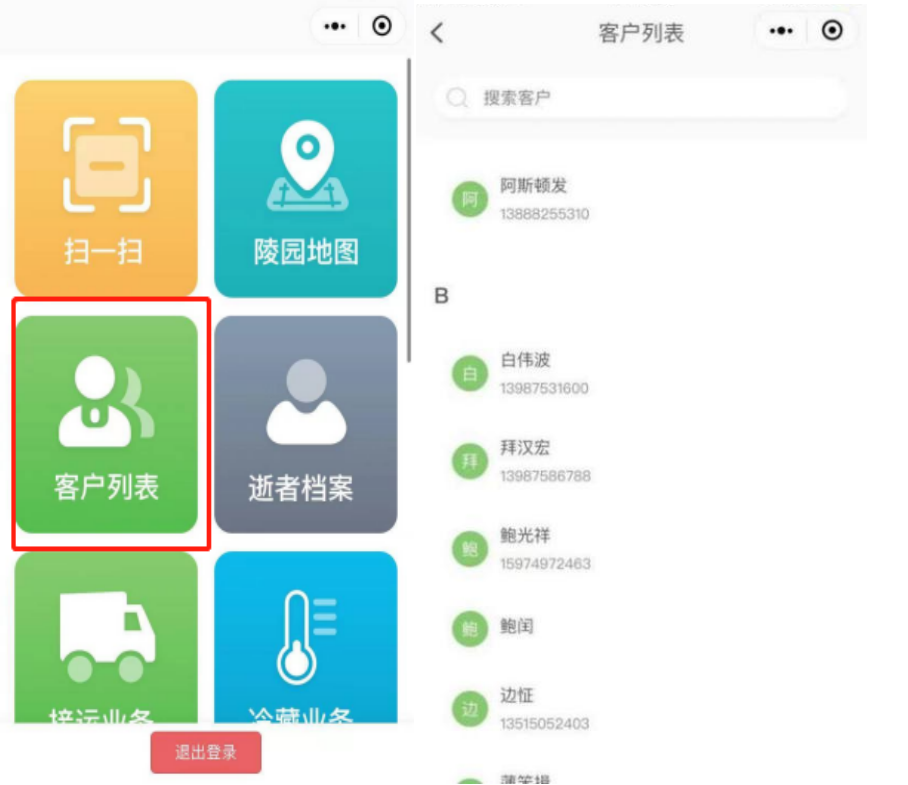
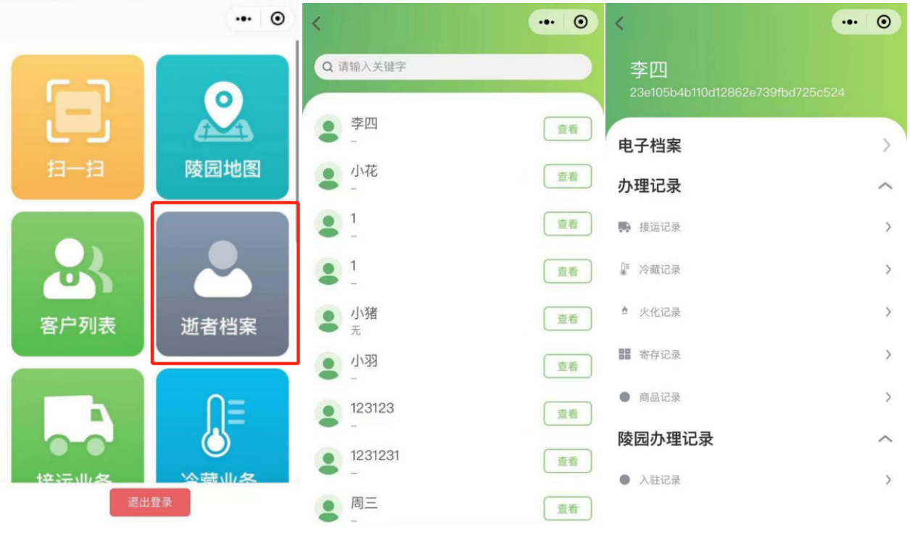
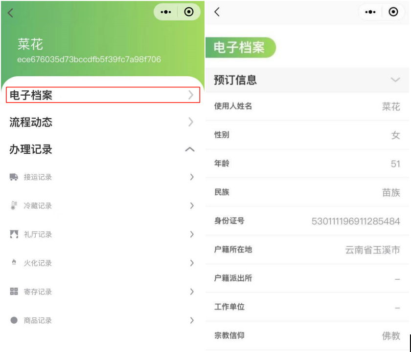
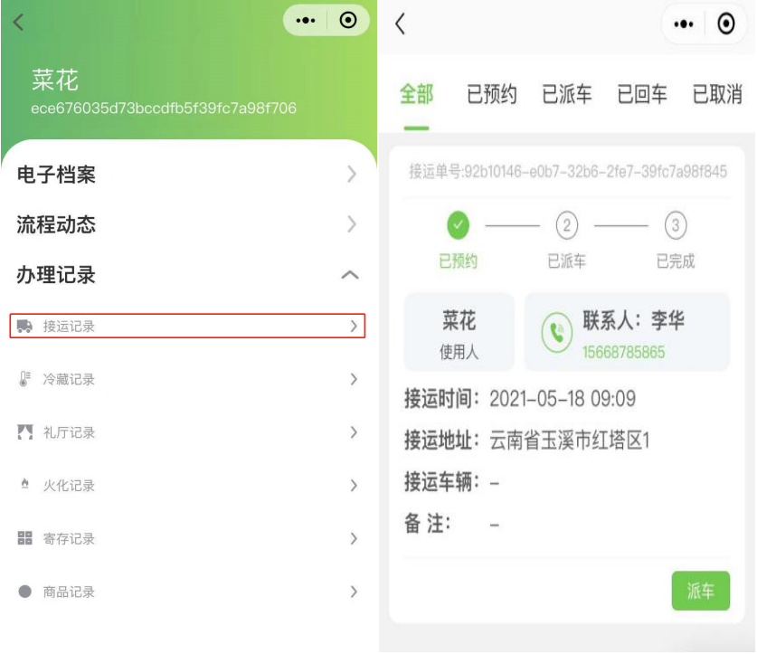
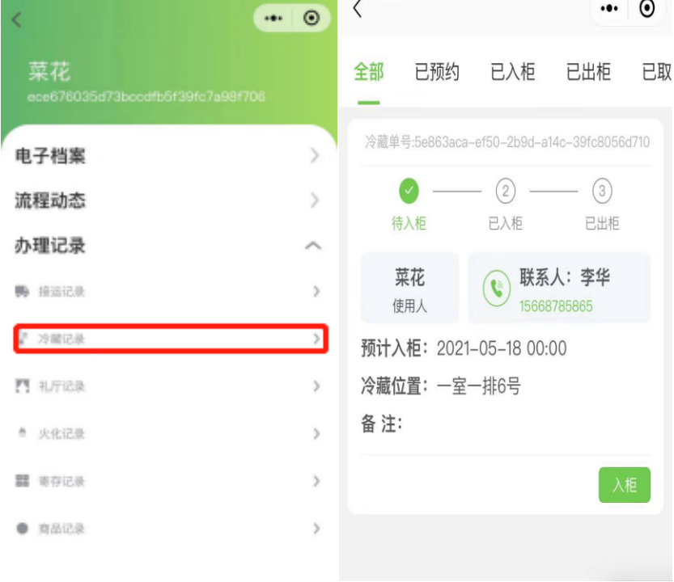
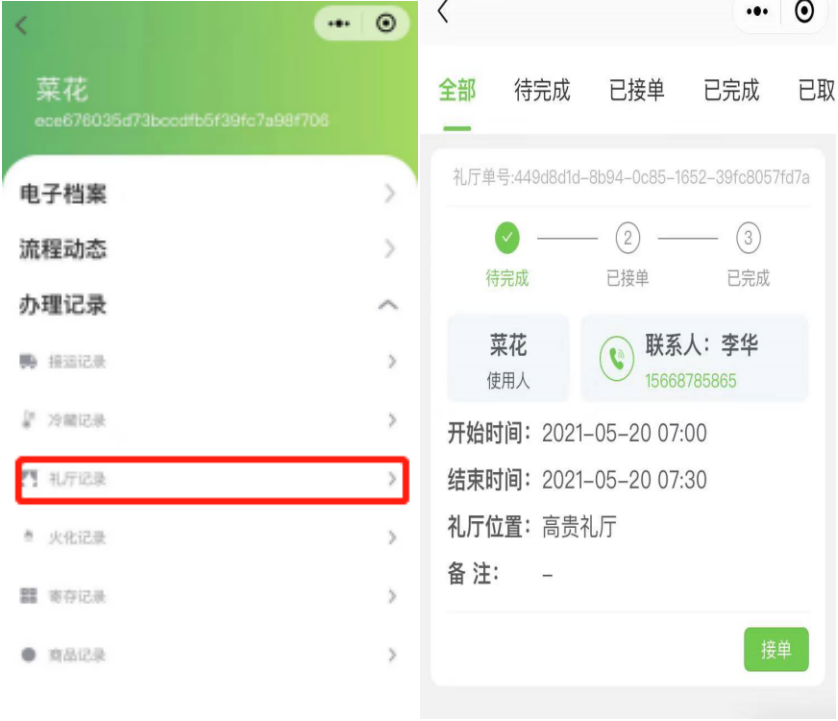
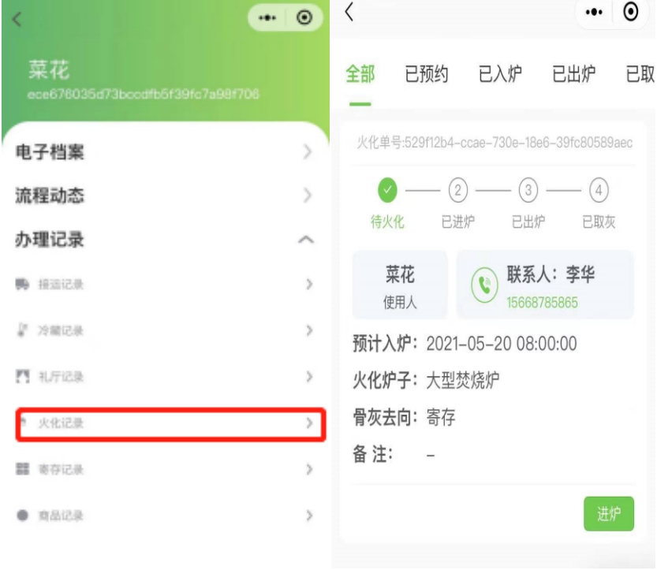
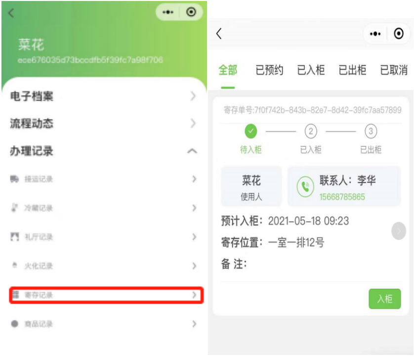
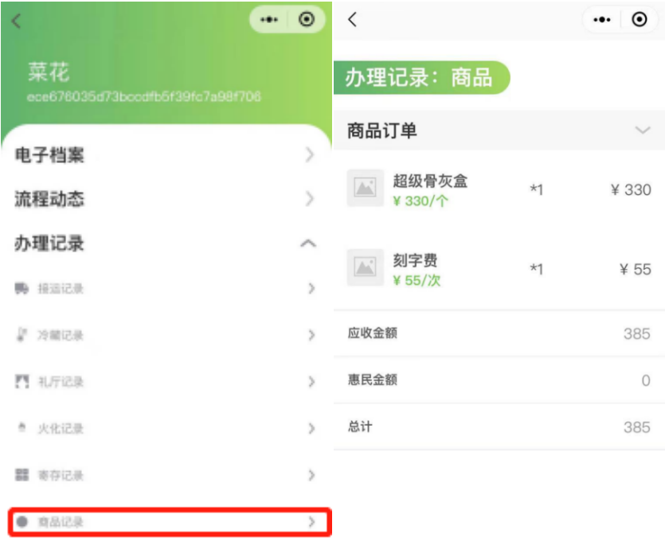

### 客户列表

点击 **客户列表**可以看到所有客户的信息：

### 逝者档案

点击 **逝者档案** 可以查看到使用人列表，点击”查看“可以看到使用人的**电子档案、办理记录、陵园办理**记录。

### 电子档案

点击**电子档案** 可以看到使用人的详细信息。	

### 接运记录

点击**接运业务** 可以看到 **接运信息、收费情况、接运业务** 的状态。

点击**派车→回车** 可以完成接运业务的订单。

### 冷藏记录

点击**冷藏记录** 页面可以查看使用人的**遗体冷藏状态，收费情况** 。

点**入柜→出柜** 可以完成遗体冷藏业务的订单。

### 礼厅记录

点**礼厅记录** 页面可以查看使用人的 **礼厅状态，收费情况** 。

点击**接单** 可以完成礼厅业务的订单。

### 火化记录

点击**火化记录** 页面可以查看使用人的**遗体火化状态，收费情况** 。

点击**进炉→出炉** 可以完成遗体火化业务的订单。

### 寄存记录

点**寄存记录** 页面可以查看使用人的**骨灰寄存状态，收费情况** 。

点击**入柜→出柜** 可以完成骨灰寄存业务的订单

### 商品记录

点击**商品记录** 可以查看**订单信息** 和**订单的价格** 。

