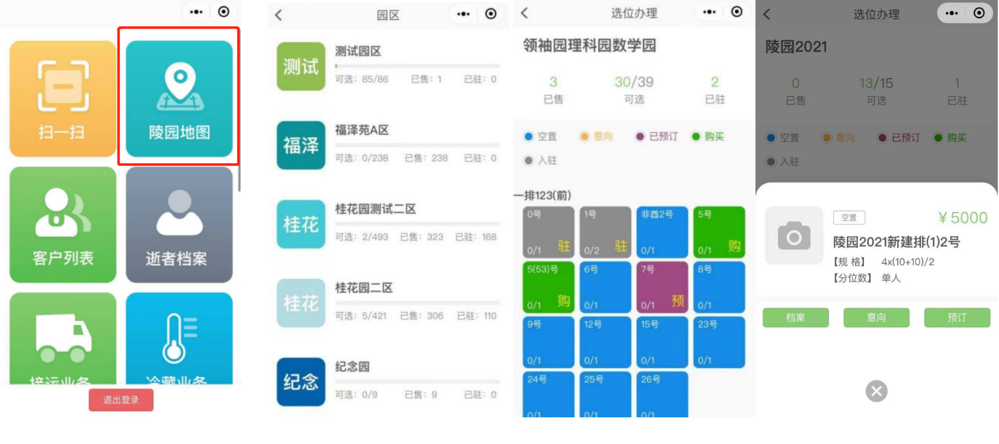
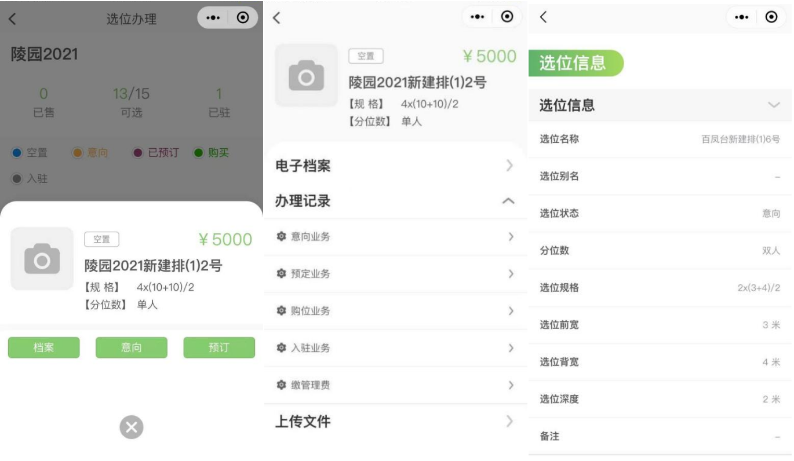
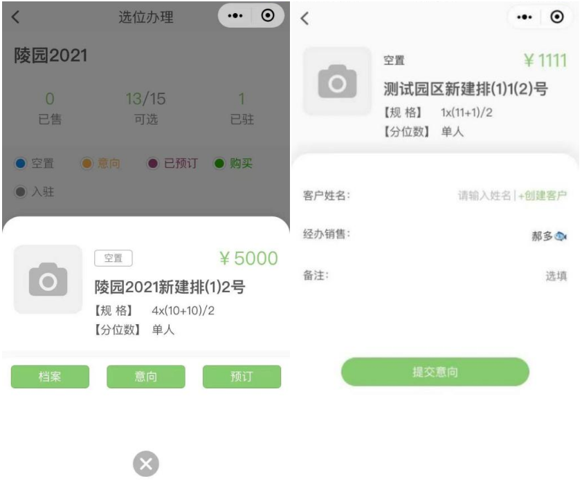
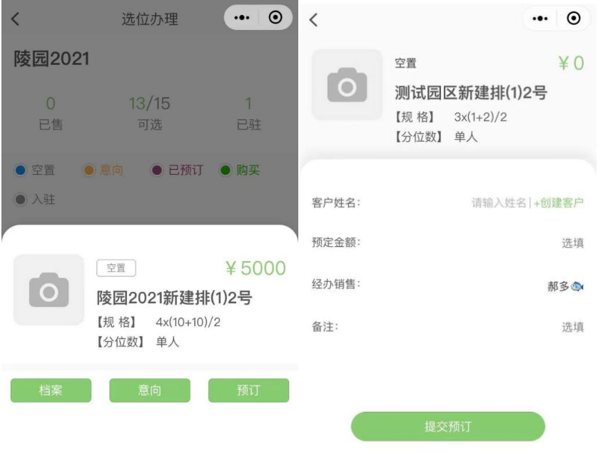
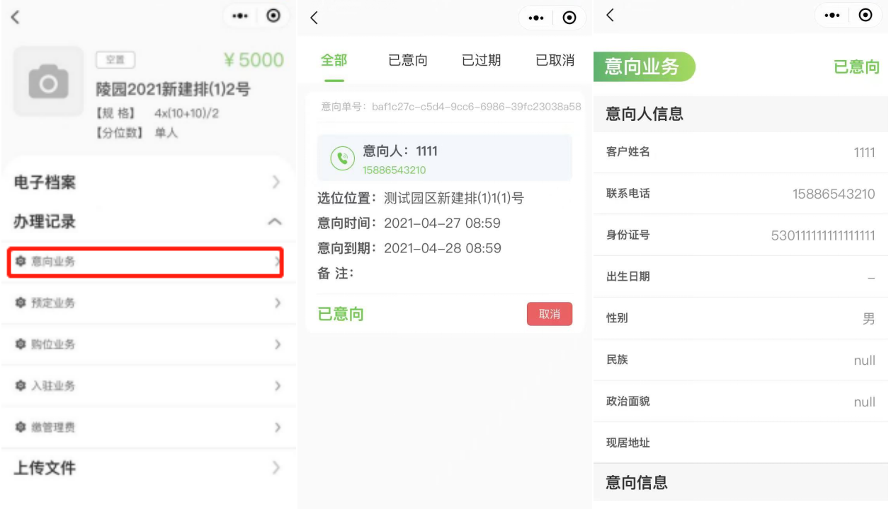
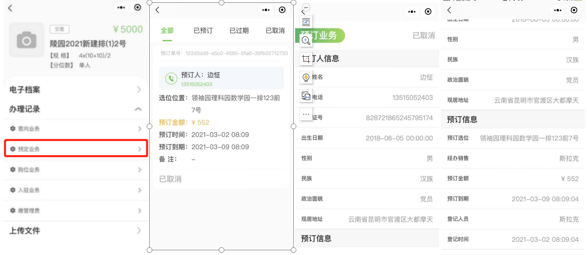
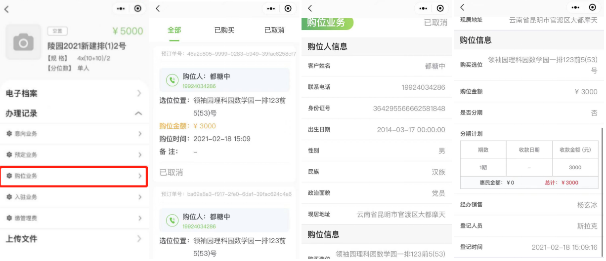
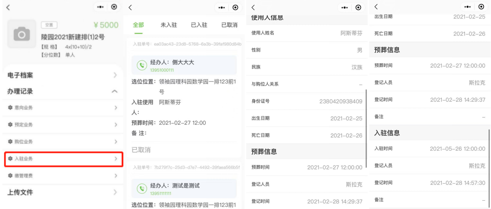

#### 选位办理

点击**陵园地图**  能查看到陵园中的所有 **园区**。

点击 ”园区“可以看到园区 **福位分布情况、福位状态**。（蓝色→空闲、黄色→预定、紫色→预定、绿色→购买、灰色→入驻）

点击 “福位“ 可以查看到 **福位信息**。可以在福位中打开“档案”“福位意向”“福位预定”功能。

### 档案

点击”档案“能查看 **电子档案、办理记录、上传文件。**

点击”电子档案“可以看到 **福位信息。**

### 福位意向

点击 **福位意向** 填写意向人信息后，点击 **提交意向** 完成对福位意向业务的创建。

### 福位预订

点击 **福位预定** 填写预定人信息后，点击**提交预定**完成对福位预定业务的创建。

点击**意向业务** 可以查看到福位意向业务单的状态。（取消→对福位意向业务单进行取消）

点击**意向人** 可以查看到意向人的信息和福位意向信息。

点击**预定业务**可以查看到福位意向业务单的状态。（取消→对福位预定业务单进行取消）

点击**预定人**可以查看到预定人的信息和福位预定信息。

点击**购位业务** 可以查看到福位购买业务单的状态。（取消→对福位购买业务单进行取消）

点击**购位人** 可以查看到购位人的信息和福位购买信息。

点击**入驻业务**可以查看到福位入驻业务单的状态。（取消→对福位入驻业务单进行取消）

点击**入驻人**可以查看到入驻人的信息和福位入驻信息。

