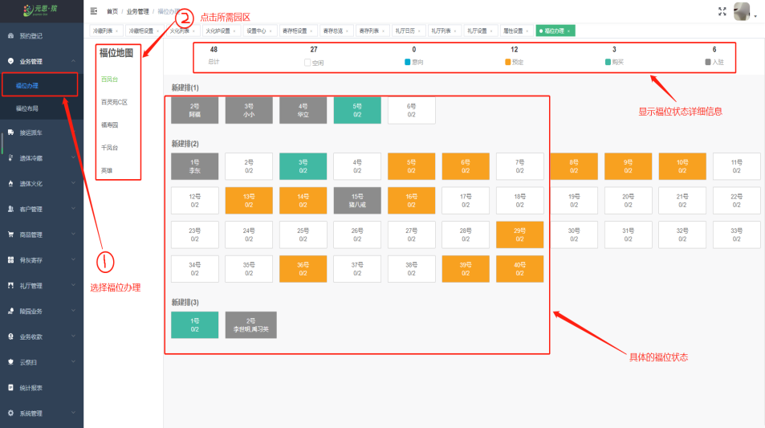
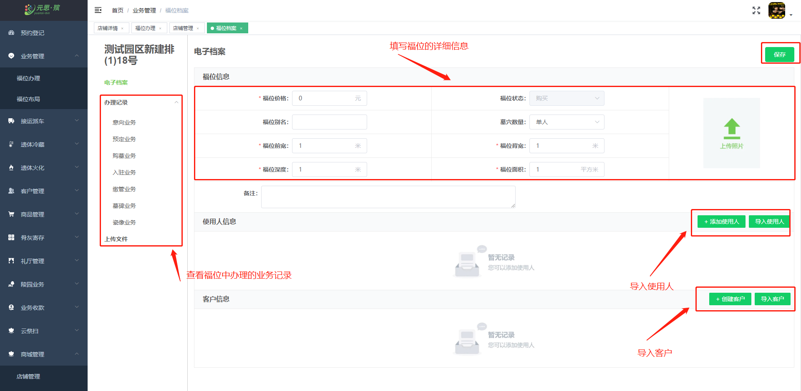
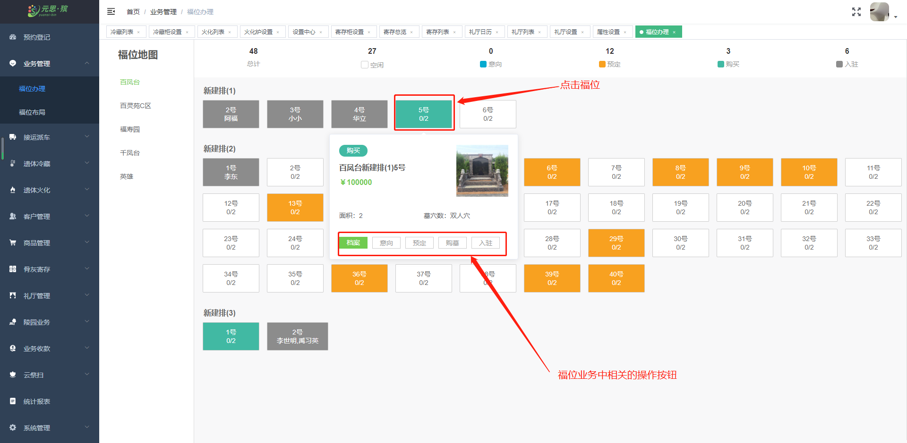
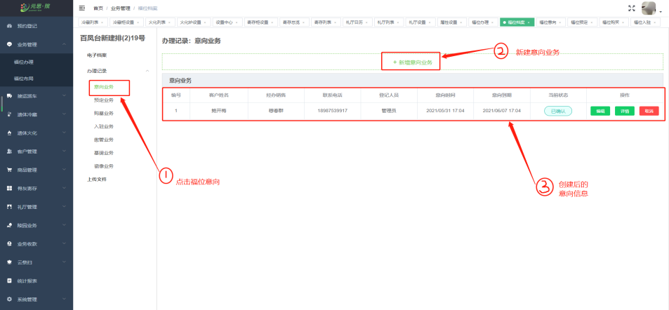
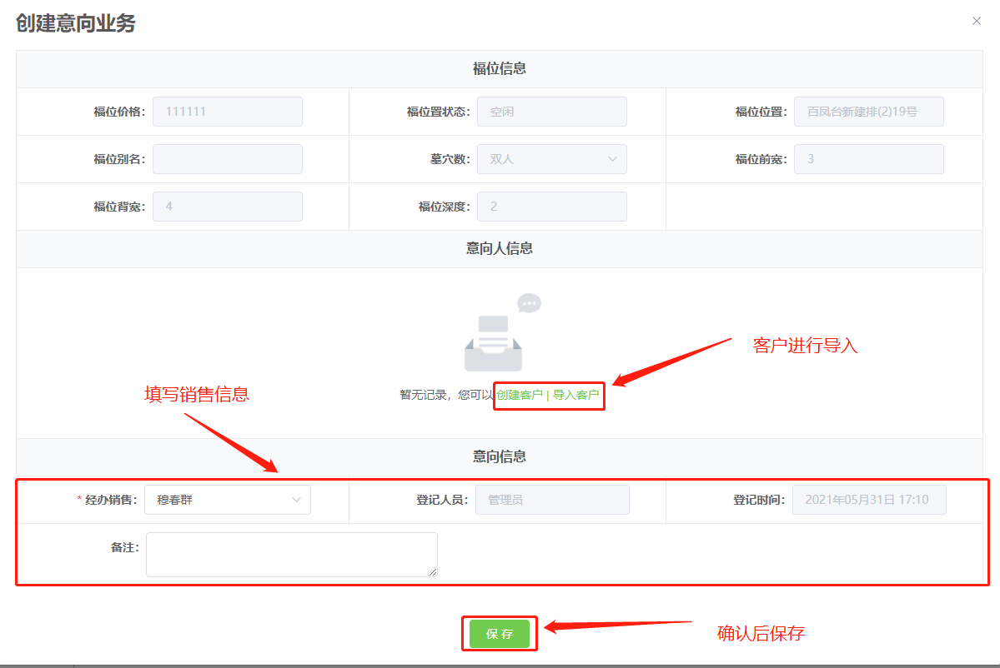

### 业务办理

在 **【福位办理】** 中，点击“福位办理”可以通过福位地图快速且直观地了解园区 **福位分布、福位状态。**

**【福位地图】** 中，点击一个福位，可以选择 **福位意向、福位预定、福位购买、福位购买、福位入驻** 业务进行办理，还能查看 **福位档案**。

**【福位档案】** 中，查看到福位 **详细信息、墓碑照片、业务办理记录、上传文件、入驻信息** 等业务记录。

**【福位意向】** 中，福位意向业务创建流程： **福位意向→新建意向业务→福位意向业务创建成功**。

