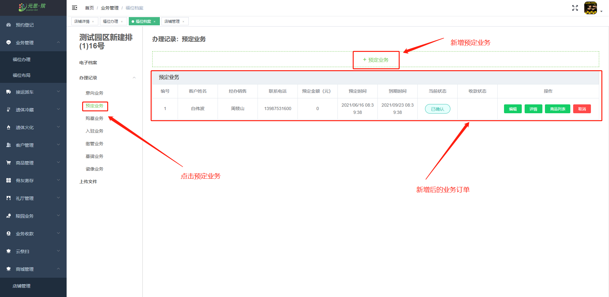
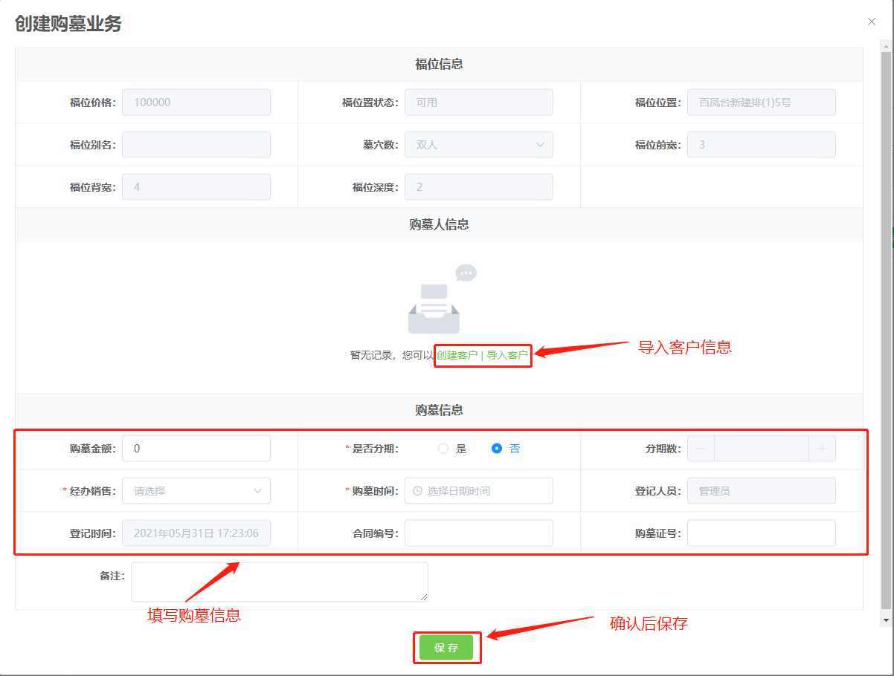
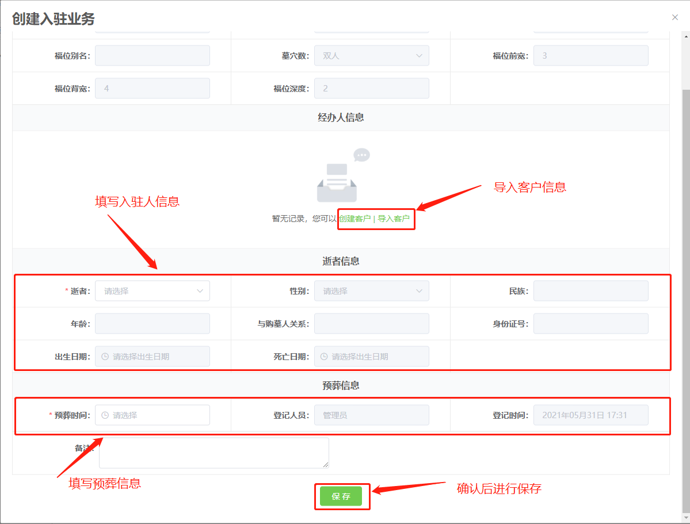
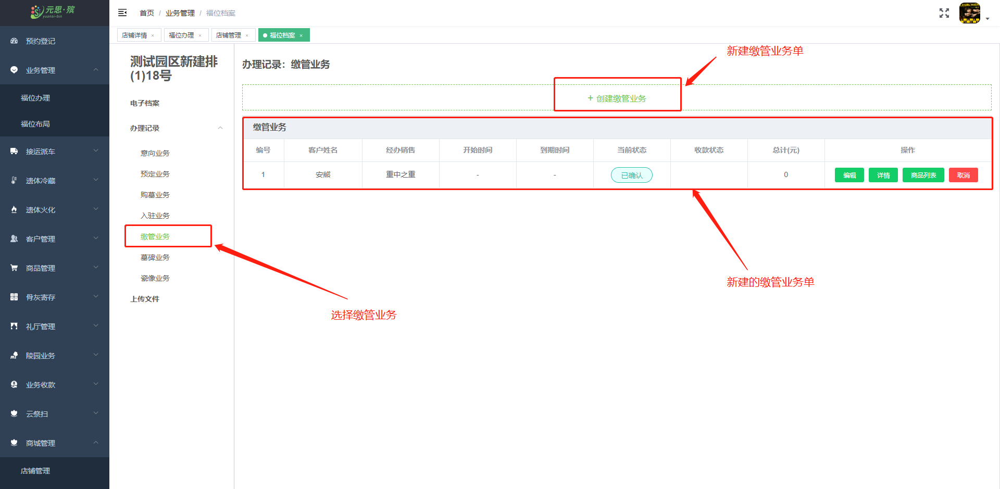

### 业务办理

在 **【福位办理】** 中，点击“福位办理”可以通过福位地图快速且直观地了解园区 **福位分布、福位状态。**

**【福位地图】** 中，点击一个福位，可以选择 **福位意向、福位预定、福位购买、福位购买、福位入驻** 业务进行办理，还能查看 **福位档案**。

**【福位档案】** 中，查看到福位 **详细信息、墓碑照片、业务办理记录、上传文件、入驻信息** 等业务记录。

**【福位意向】** 中，福位意向业务创建流程： **福位意向→新建意向业务→福位意向业务创建成功**。

**【福位预订】** 中，福位预定业务创建流程： **福位预定→新建预定业务→客户信息导入→保存**

**【购墓】** 中：福位购买业务创建流程：**福位购买→新建购买业务→导入客户信息→填写预定金额→保存。**

**【福位入驻】** 中，福位入驻业务创建流程： **点击电子档案（导入使用人信息）→点击入驻业务→新建入驻业务→导入客户信息→填写入驻人信息→保存。**

**【缴管业务】** 中，福位缴管业务创建流程：**点击缴管业务→创建管理费业务单→导入客户信息→填写金额→保存。**

**【墓碑业务】** 中，墓碑业务创建流程：**点击墓碑业务→创建墓碑业务→点击购买墓碑（选择墓碑类型）→导入客户→保存.**

**【瓷像业务】** 中，瓷像业务创建流程： **点击瓷像业务→新建瓷像业务→购买瓷像（添加瓷像类型）→导入客户→保存。**

