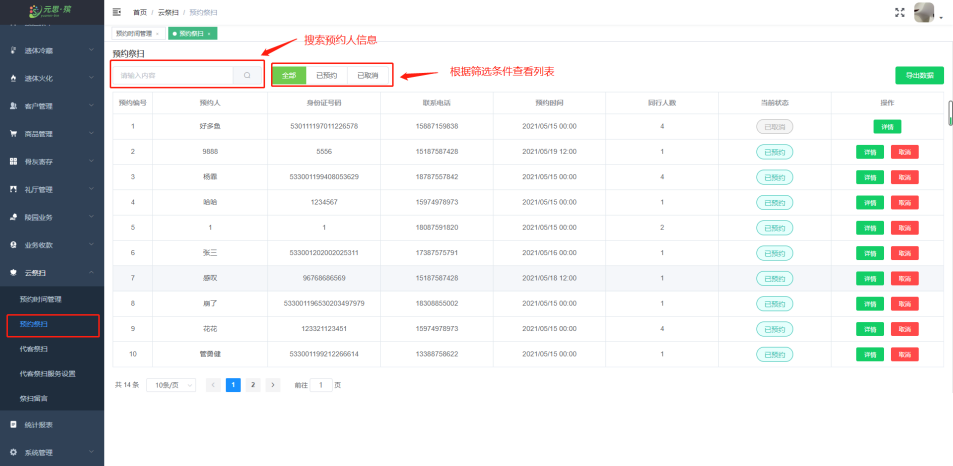

#### 预约时间管理

**[预约时间管理]** 中，设置祭扫 **预约时间、预约人数**。

**[预约祭扫]** 中，预约祭扫显示**预约人信息、预约时间、预约人数**等信息。

**[代客祭扫]** 中，代客祭扫显示**预约人信息、代客祭扫时间、收款状态**操作按钮等信息。

**[祭扫详情]** 中，点击详情查看到预约人的祭 **扫服务类型、福位信息、祭扫照片和视频**。

**[代客祭扫服务设置]** 中，服务设置中能添加**服务类型、设置服务价格**等信息。

**[祭扫留言]** 中，祭扫留言显示预约人对逝者的 **留言信息**。

