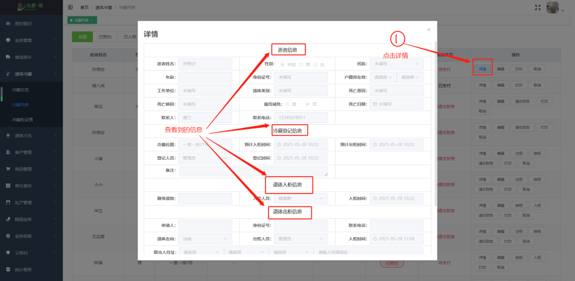

#### 冷藏业务

**【冷藏总览】** 中，打开冷藏总览可以查看 **冷藏柜状态。**

 

**【冷藏柜】** 中，点击一个冷藏柜，可以查看到冷藏柜 **详情、编辑信息、取消** 操作按钮。

 

**【冷藏列表】** 中，冷藏列表里显示出**使用人列表、订单状态、入柜时间、出柜时间**业务操作按钮。

 

**【冷藏详情】** 中，查看到 **逝者信息、冷藏登记信息、入柜信息、出柜信息。**

 
**【打印】**

 

**【冷藏柜设置】** 中，添加冷藏室的流程：**点击冷藏柜设置→点击添加冷藏室→添加排→添加成功**

 
**【新增冷藏柜】**

 
