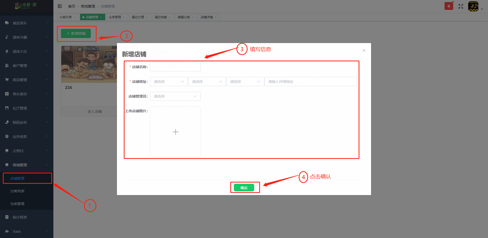
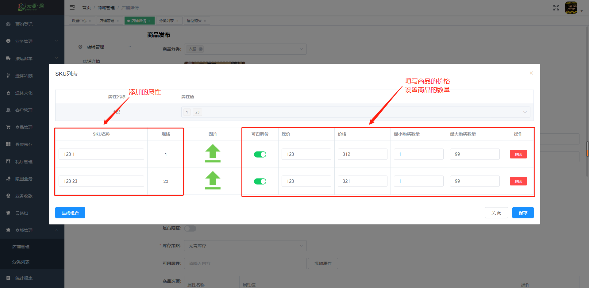

#### 商城管理

**【店铺管理】**  中，新增店铺流程： **商铺管理→新建商铺→填写商铺信息→保存**

**【店铺详情】**  ，中显示**店铺信息** 和 **店铺管理人员**。

#### 【商品管理】

**【商品列表】** 中，新建商品流程： **点击商品列表→新增商品→填写商品信息→确认保存**

**【商品编辑】** 中，生成SKU组合流程： **点击编辑→添加属性→点击SKU列表→填写商品属性→保存**。

#### 【库存管理】

**【库存列表】** 中，查看到 **商品信息**，对商品进行 **出库** 和 **入库**的操作。

**【入库】**

**【出库】**

