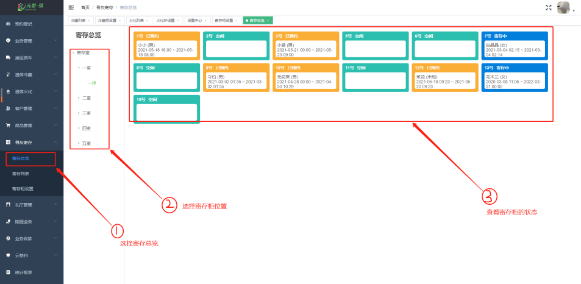
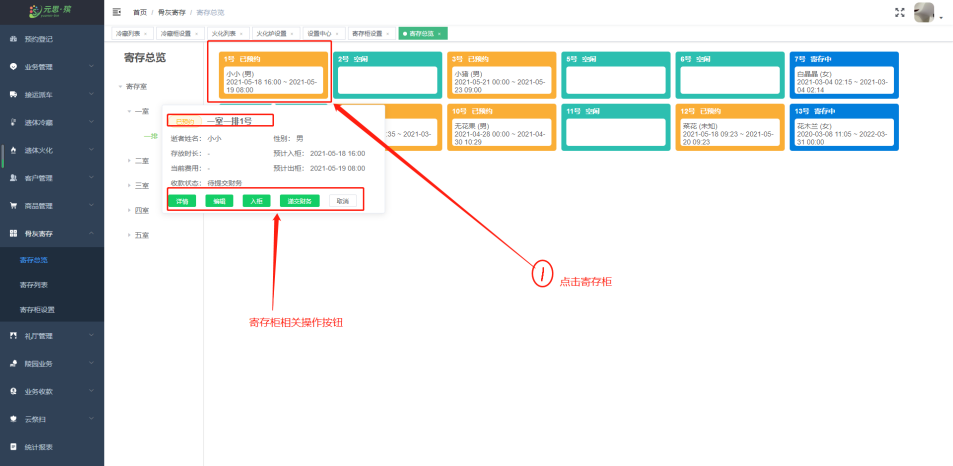
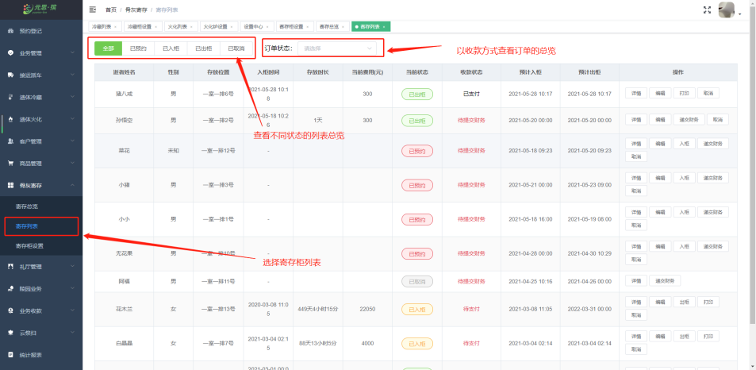
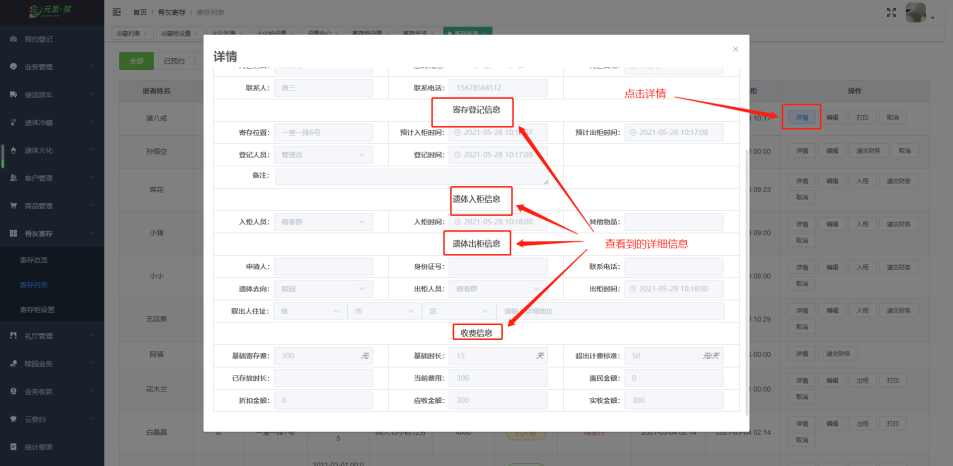
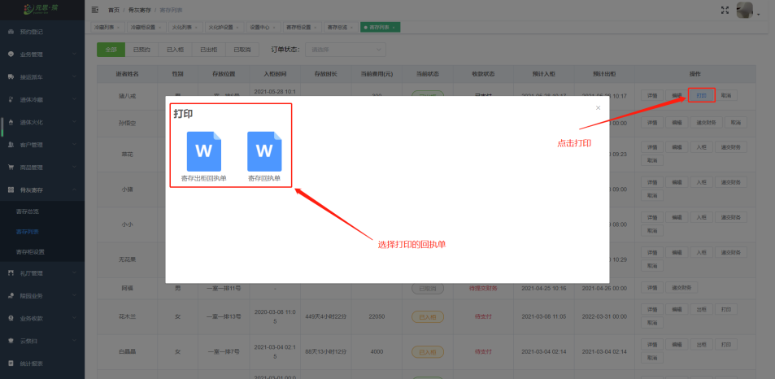
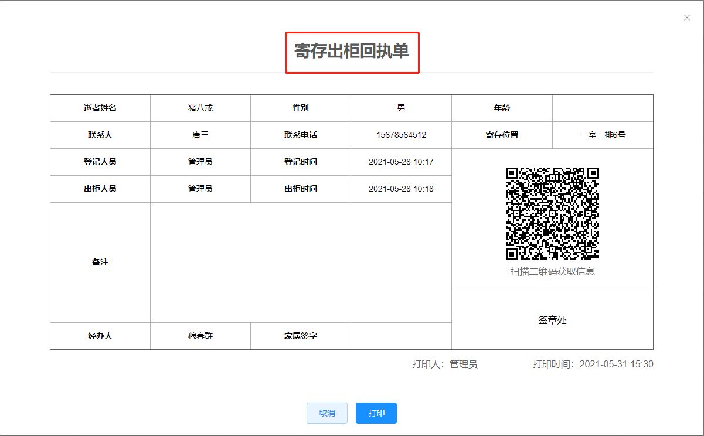
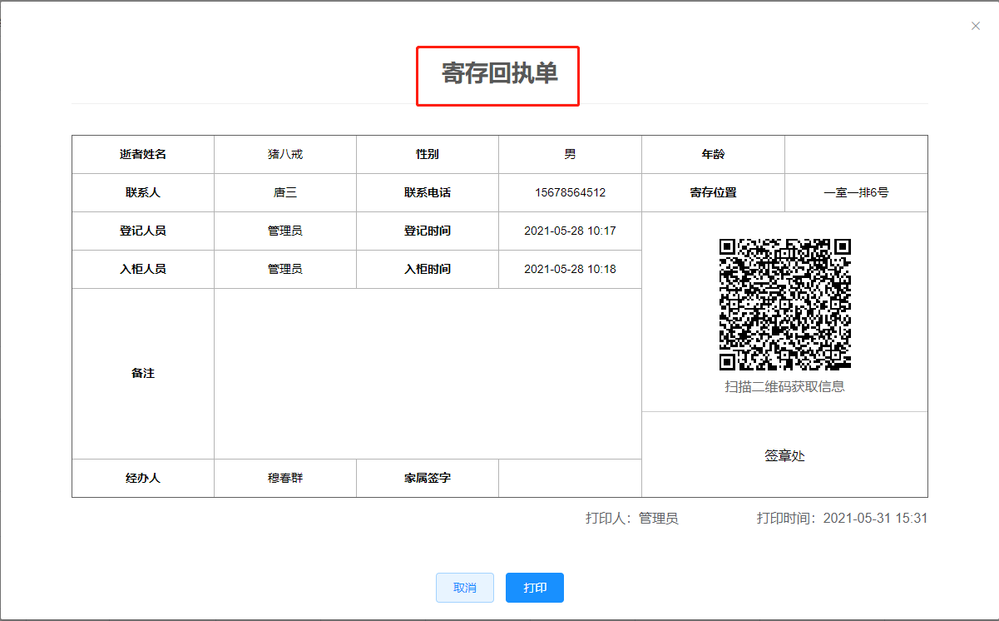
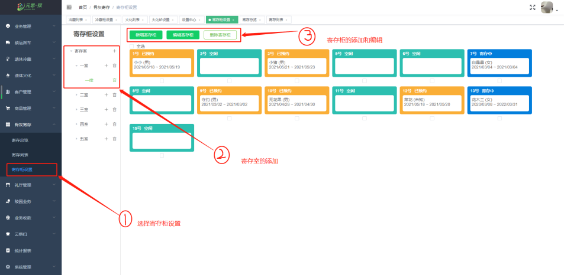
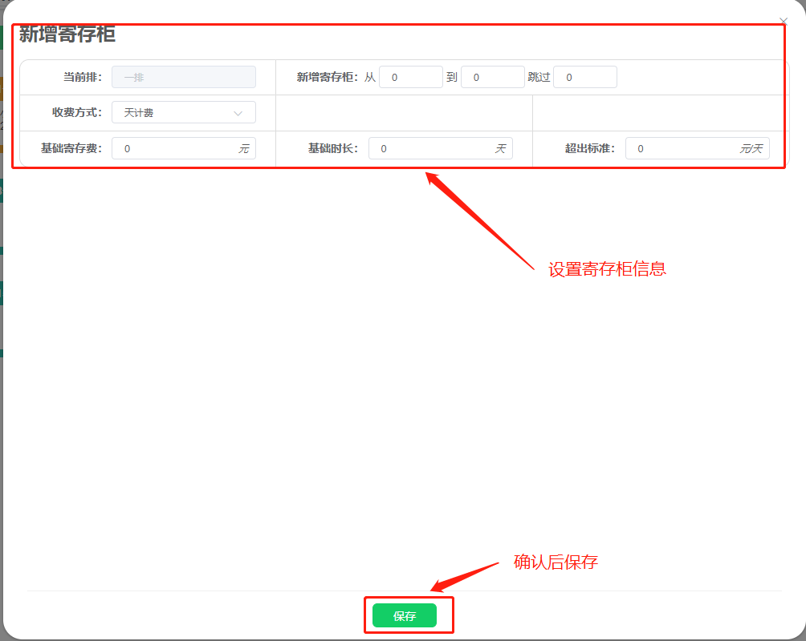

#### 骨灰寄存

**【寄存柜总览】** 中，点击寄存柜总览，选择寄存柜位置，可以查看到**寄存柜状态**。

**【寄存柜】** 中：点击寄存柜显示出 **详情、编辑、入柜、出柜递交财务、取消** 的操作。

**【寄存列表】** 中：寄存列表里显示业务 **订单状态、入柜和出柜时间、寄存费用** 业务操作按钮的信息。

**【寄存详情】** 中，点击详情查看到 **使用人信息、登记信息、入柜出柜信息、收费信息**。

**【打印】** 中，打印出 **入柜回执单** 或者 **出柜回执单**。

**【寄存柜设置】** 中，添加寄存柜流程： **点击寄存柜设置→寄存柜→添加排→点击新增寄存柜→填写寄存柜信息→保存**。

