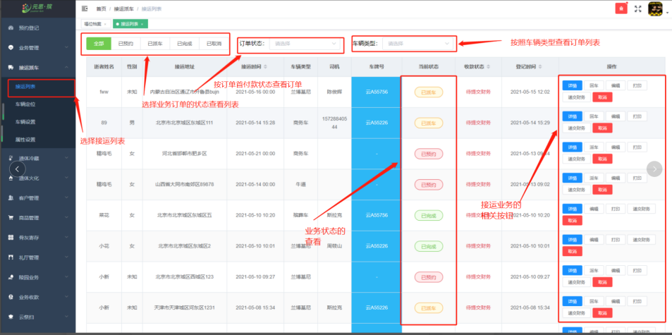
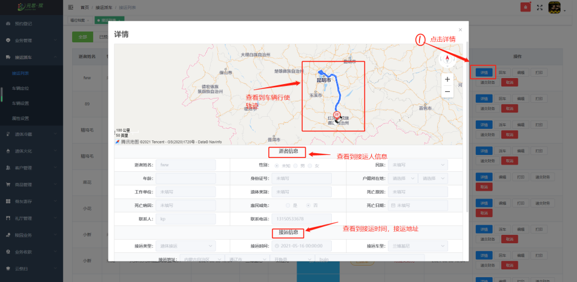
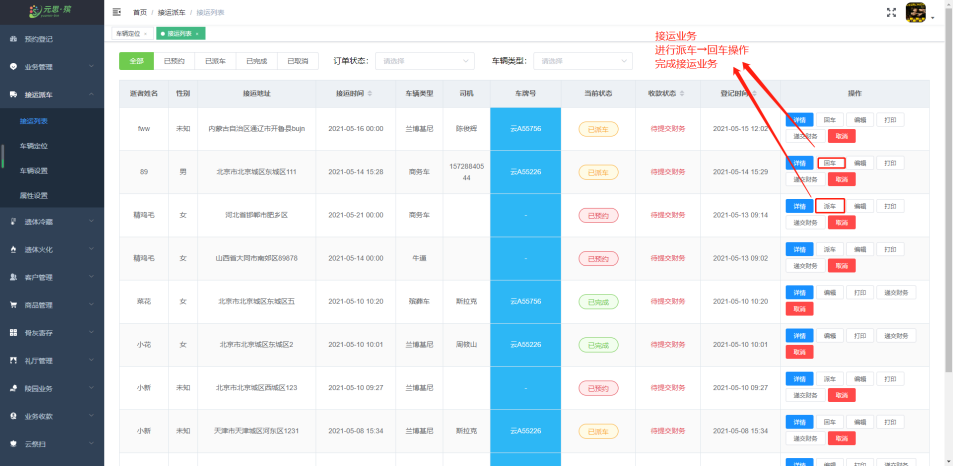
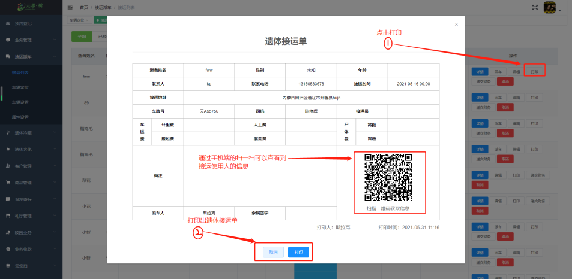
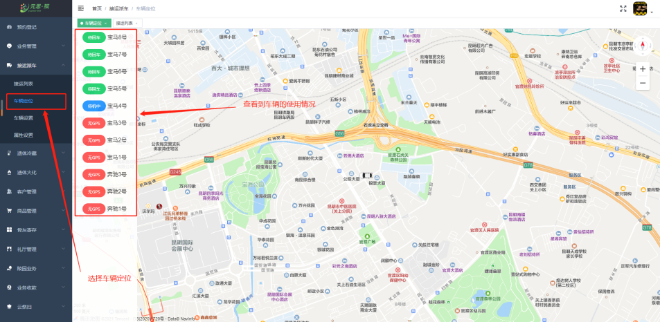
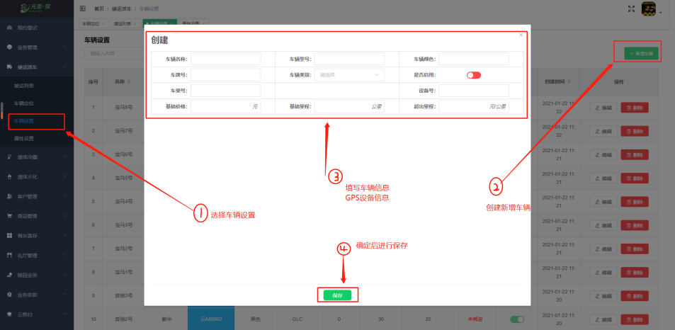
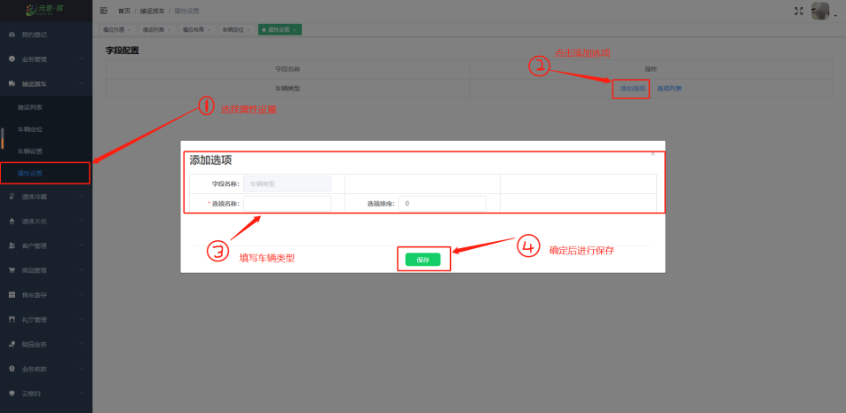

**[接运列表]**  中，用户可在接运列表中点击**编辑、详情、取消、派车、打印、回车**等操作按钮。

**【详情】** 中，点击接运业务订单详情：能查看到车辆 **接运路线、接运人信息、接运地址、接运时间、接运费用** 。

**【派车→回车】**

**【打印】**

 **【车辆定位】** 中，车辆定位能看到 **车辆状态、车辆位置**。

 

**【车辆设置】** 中，绑定GPS流程：**车辆设置→新建车辆→填写车辆信息和GPS设备号→保存**

**【车辆属性】**中，新增**车辆类型。**

