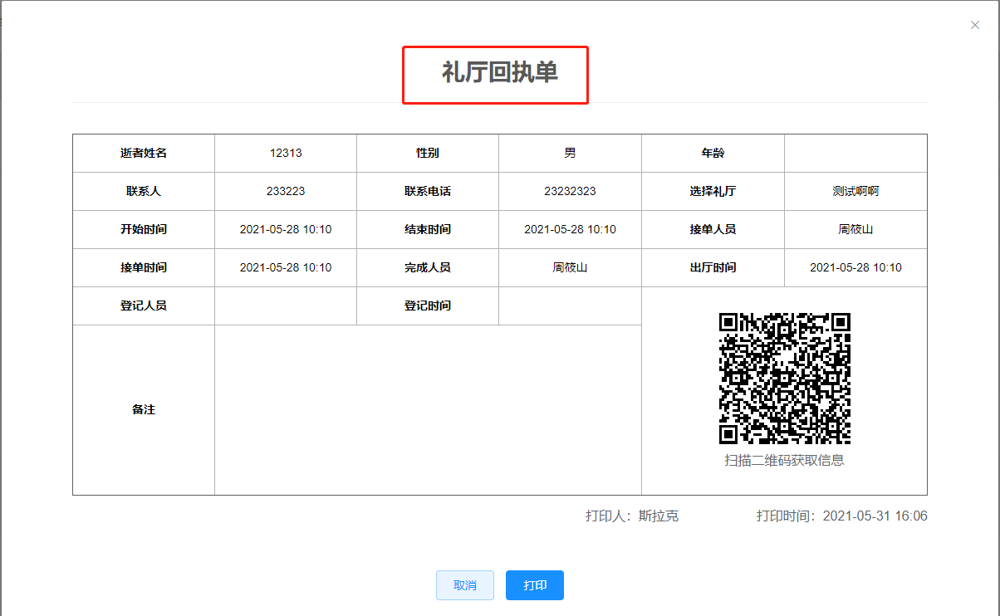

#### 礼厅管理

**【礼厅日历】** 中，礼厅日历显示 **礼厅状态、开始时间、结束时间**。

**【礼厅列表】** 中，礼厅列表中显示**业务状态、开始和结束时间、费用、业务**相关操作信息。

**【礼厅详情】**中，点击详情看到**使用人信息、登记信息、接单和完成时间、收费信息**。

**【打印】** 中，点击 **打印→礼厅回执单**。

**【接单】**

**【完成】**

**[礼厅设置]** 中，礼厅设置流程：**点击礼厅设置→新增礼厅→填写礼厅信息→保存。**

**[属性设置]**

