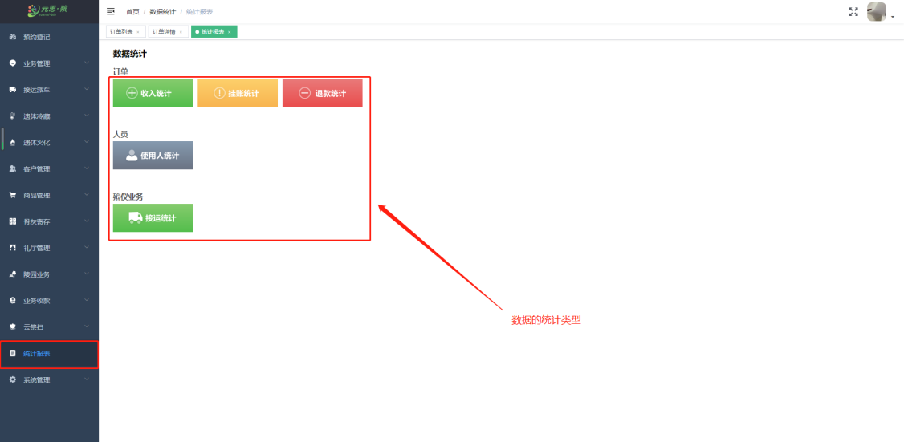
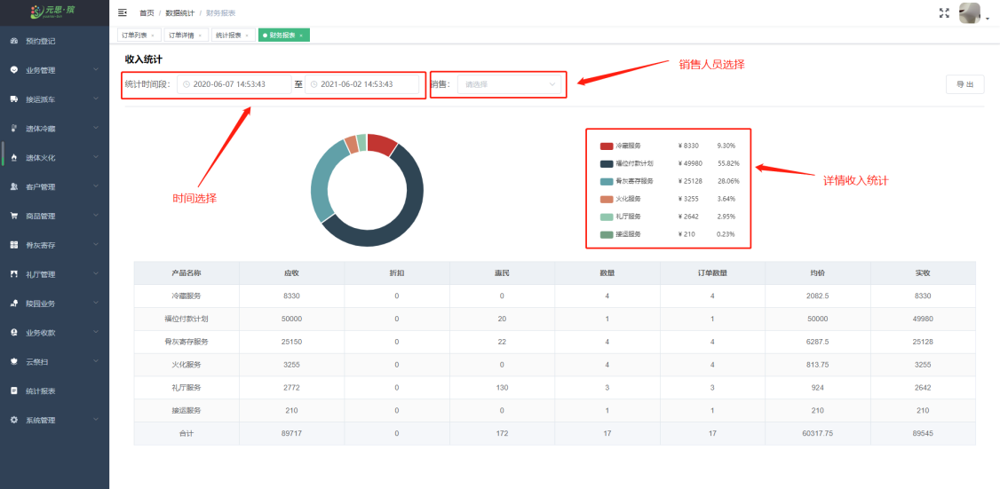
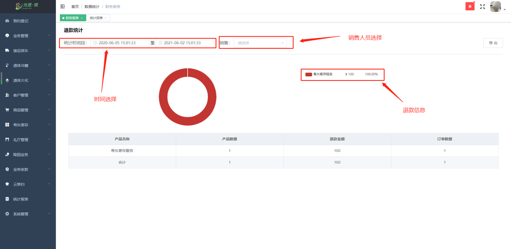
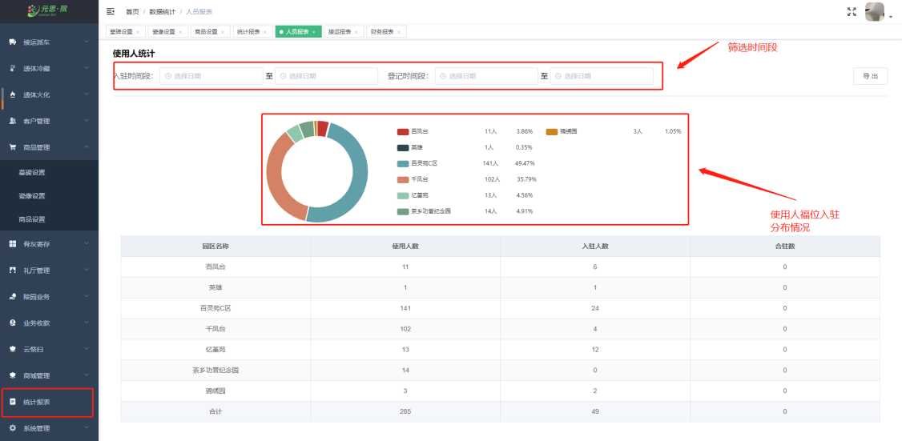
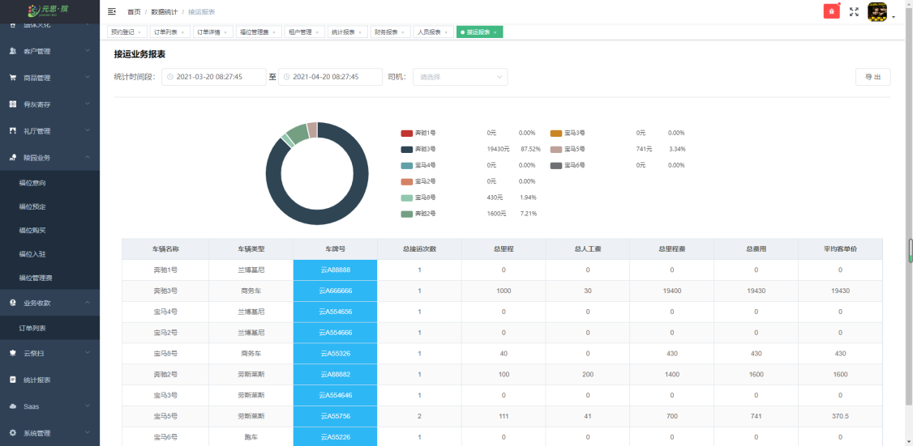

#### 统计报表

**【数据统计】** 对园区经营情况进行统计分析，指标包括：**收入统计、挂账统计、按退款统计、使用人统计、接运统计**.

**【收入统计】** 中，可以按照**时间选择** 和 **销售人员选择**查看收入数据。

**【退款统计】** 中，退款统计可以按照 **时间选择** 和 **销售人员选择**查看退款数据。

**【使用人统计**】 中，通过筛选时间段查看**使用人福位入驻**的分布情况。

****

**【接运统计】** 中，可以查看到车辆**接运数据**的情况。

