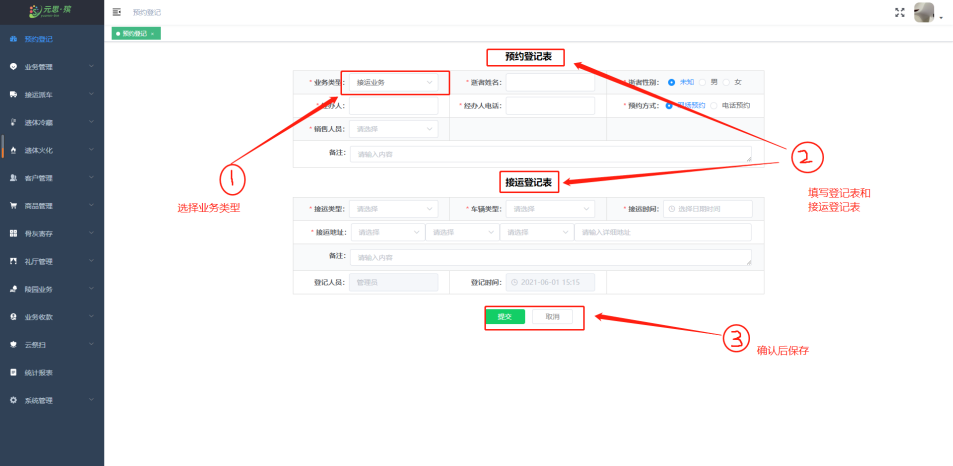
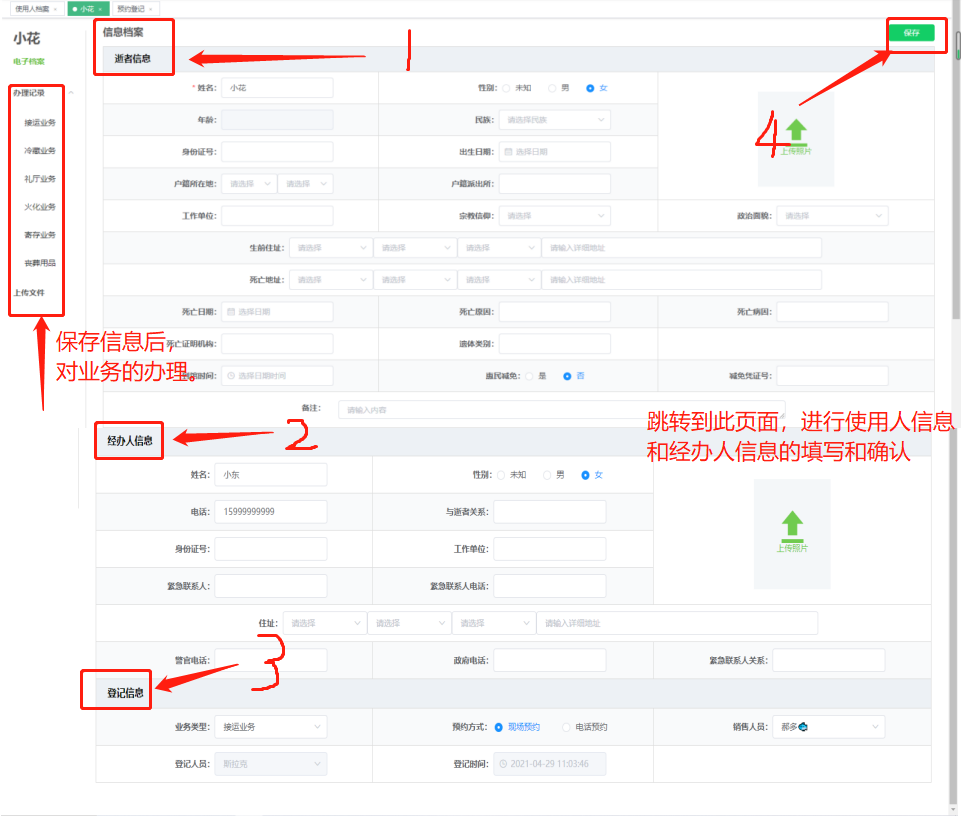

### 用户登录

用户进入**元思·殡后台管理系统**登陆界面。

**【密码登录】** 输入**账号、密码**进行登录。

### 预约登记

预约登记页面可以填写 **预约登记表、接运登记表**。

在 **【预约登记表】** 中，填写是逝者的**基础信息，包括性别、业务的类型。**

在 **【接运登记表】** 中，填写 **接运类型** 和 **接运地址**。

### 使用人档案

【**使用人档案**】 中 ，填写 **逝者信息、客户信息** ，保存后对 **办理业务**。

